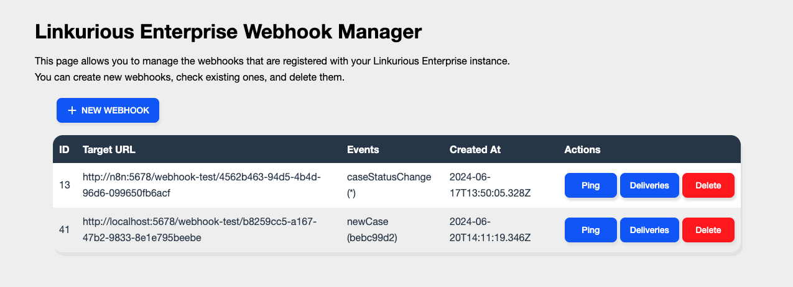
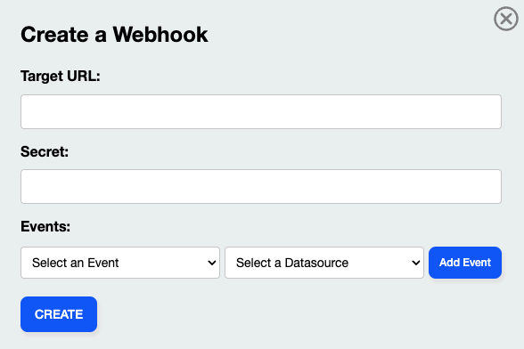

<!-- omit in toc -->
# Webhook Manager [plugin for Linkurious Enterprise](https://doc.linkurious.com/admin-manual/latest/plugins/)

<!-- auto generated with https://marketplace.visualstudio.com/items?itemName=yzhang.markdown-all-in-one -->
<!-- omit in toc -->
## Table of contents
- [Compatibility](#compatibility)
- [Configurations](#configurations)
- [URL Parameters](#url-parameters)
- [User Manual](#user-manual)
  - [Create a Webhook](#create-a-webhook)
  - [Delete a Webhook](#delete-a-webhook)
  - [Ping a Webhook](#ping-a-webhook)
  - [Check Deliveries](#check-deliveries)
- [Licensing](#licensing)

# Compatibility

This plugin is compatible with Linkurious Enterprise starting from v4.0.25.

# Configurations

This plugin does not require any additional configuration parameter.

# URL Parameters

The plugin can be accessed from its home page without the need to specify any URL parameter.

# User Manual

This plugin allows you to manage the [webhooks](https://doc.linkurious.com/admin-manual/latest/webhooks/) that are registered with your Linkurious Enterprise instance.

With a default configuration, it is possible to access the plugin under the `/plugins/webhook-manager` path (e.g. `http://127.0.0.1:3000/plugins/webhook-manager`).

Access to the plugin is allowed only to users who are part of the `admin` group (please, refer to [this page](https://doc.linkurious.com/admin-manual/latest/access-control/) for more information on Linkurious Enterprise access control).

The plugin allows the following actions to be performed:

- create a new webhook;
- delete an existing webhook;
- ping an exising webhook;
- see the deliveries history of an existing webhook.

## Create a Webhook

By clicking on the `+ ADD` button in the main page, it will be possible to create a new webhook via a form.

Once the form has been filled in (please refer to the [official documentation](https://doc.linkurious.com/server-sdk/latest/apidoc/#api-Webhook-createWebhook) for more information on the fields), simply click on the `CREATE` button to add the webhook.

Any errors and/or invalid values will be shown in the form.

##  Delete a Webhook

A `Delete` button is present on each row of the Webhooks table.
By clicking on it, and after confirming your choice, the relevant Webhook will be deleted

> NOTE: it is not possible to undo this operation.

For more information on this action, please refer to the [official documentation](https://doc.linkurious.com/server-sdk/latest/apidoc/#api-Webhook-deleteWebhook)

## Ping a Webhook

A `Ping` button is present on each row of the Webhooks summary table.
By clicking on it a ping message will be sent to the target URL of the relevant Webhook.

You can view the response to this ping on the Webhook's [deliveries page](#check-deliveries).

For more information on this action, please refer to the [official documentation](https://doc.linkurious.com/server-sdk/latest/apidoc/#api-Webhook-pingWebhook)

## Check Deliveries

A `Deliveries` button is present on each row of the Webhooks summary table.
By clicking on it will display the delivery history in a new browser tab. Deliveries are sorted in chronological order.

For more information on this action, please refer to the [official documentation](https://doc.linkurious.com/server-sdk/latest/apidoc/#api-Webhook-getWebhookDeliveries)

# Licensing

The `Webhook Manager` is licensed under the Apache License, Version 2.0. See [LICENSE](/LICENSE) for the full license text.
